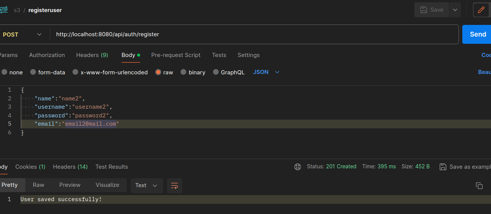
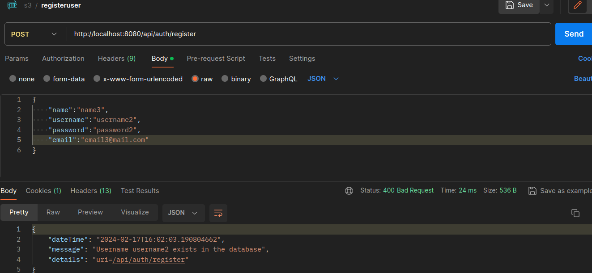
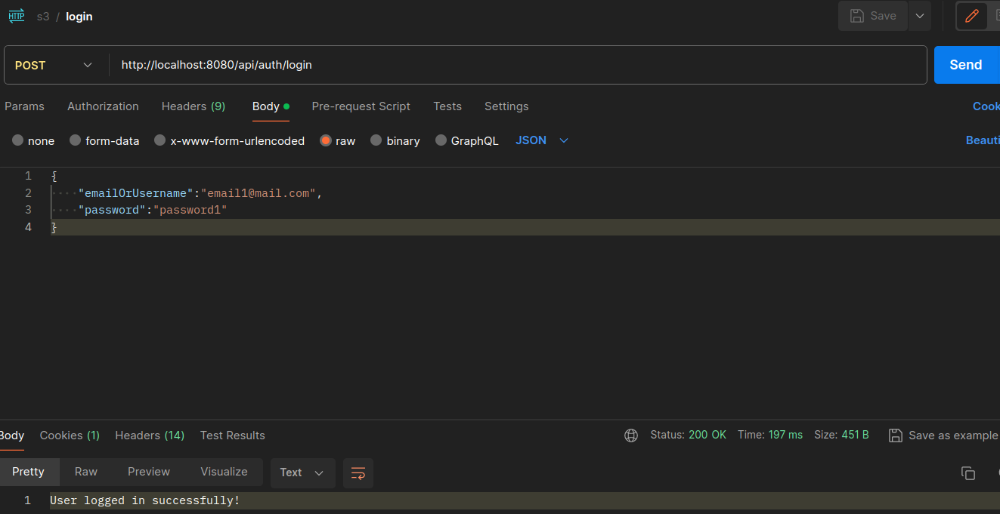
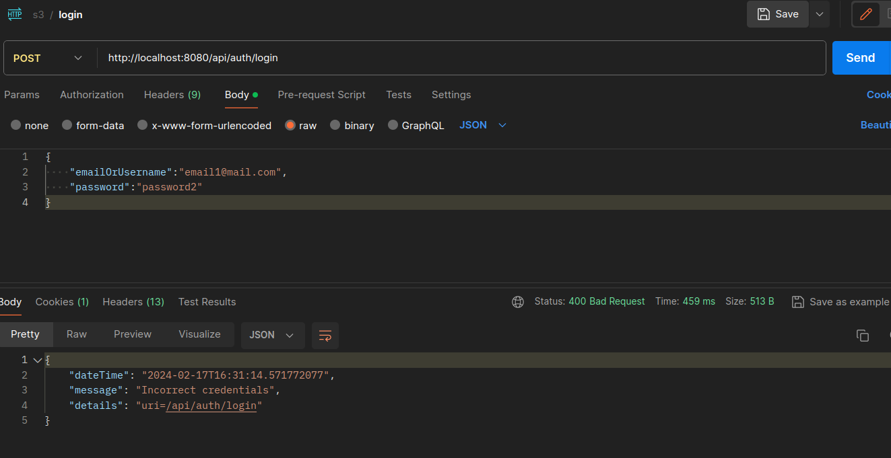

Authentication in spring.
Steps

1. authentication filter class
2. Authentication#attemptAuthentication
3. AuthenticationManager#authenticate.
4. Checks from a bunch of different authentication providers (IAuthenticationProvider) (jwt, oidc) and basis of
   implementation, the
   Provider#authenticate is called.

```agsl
   org.springframework.security.authentication.ProviderManager
    
   ProviderManager(AuthenticationProvider... providers) {
        this(Arrays.asList(providers), (AuthenticationManager)null);
    }
```

5. Each provider uses the loadUserByUsername implemented by a class implementing IUserServiceImpl

### Implementation.

> Register - endpoint /api/auth/register.

-
    - to permit all users -> authorize.requestMatchers("api/auth/**").permitAll()
-
    - method has a request body of RegisterDto.
-
    - service - checks for user already existing, if not the user is registered. (Interesting handling of exception here
      using GlobalExceptionHandler)
      
-
    - Register success case.
      
-
    - Register failure case - (if username or email matches)

> Login - endpoint /api/auth/login

-
    - implementation for AuthenticationManager -> DaoAuthenticationProvider.
-
    - controller method has request body of LoginDto
-
    - AuthenticationManager#authenticate -> using UsernamePasswordAuthenticationToken ->
-
    - User fetched from UserDetailsServiceImpl#loadByUsername
-
    - security.core.userdetails.User returned
      
-
    - Login case - (if username or email matches)
      
-
    - Login fail case - (Incorrect credentials)

## JWT
- why it was needed ? what did it replace or improve upon ?
- benefits of jwt - advantages

### Architecture

3 parts 
- Header
- - algo, type
- Payload
- Signature

while authentication, server responds with a jwt token.
that token is passed in all further requests.

> JwtTokenProvider 
- to create token that is sent to user after logged in. 
- This token is used in every request thereafter.

> JwtAuthenticationFilter
- to fetch/validate the token, and set authentication.  